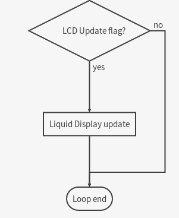

Wireless Motordrive
===================
Proyecto para la Actividad Práctica 4 de [Sistemas Empotrados y de Tiempo Real](https://www2.ulpgc.es/index.php?pagina=plan_estudio&ver=pantalla&numPantalla=99&nCodAsignatura=40840&codTitulacion=4008&codPlan=40&codEspecialidad=02), en la ULPGC.

Copyright (c) 2017 Diego Sáinz de Medrano.

# Componentes

Se han usado las siguientes piezas de hardware aparte de la placa Arduino Uno:

- RD02 - 12V robot drive [de Robot Electronics][1]
- LCD05 - 16x2 green [de Robot Electronics][2]
- XBee 2mW S2C con antena [de Digi][3]
- XBee Explorer USB [de Digi][4]

# Montaje

# Operación del robot

# Interfaz de comandos
En el otro extremo del software está la aplicación de consola que se encarga de comunicarse con el robot a través de un módulo XBee configurado como coordinador. La aplicación está dividida en módulos encargados de diferentes tareas, como el procesado de la entrada de texto, la obtención de la fecha actual y la comunicación per se (este último módulo está basado en la aplicación *super_serial*).

Existen dos modos para interactuar con el robot, **normal** y **direccional**.

## Modo normal
Se procesa la entrada de teclado como texto normal, y se reconocen los siguientes comandos:

* `speed <s>` : acelera o decelera el robot hasta alcanzar la velocidad `s` (medida en mm/s)
* `toggle` : cambia a modo direccional
* `constant <k>` : cambia la constante de proporción de regulación de velocidad.
* `quit` : detiene el robot y cierra el programa.

El módulo de control de velocidad consiste de una llamada a función que se realiza de forma síncrona con una señal del Timer2 que se activa cada 8ms. La función realiza las siguientes acciones:

* registrar el tiempo y el valor de los encoders del motor
* calcular la velocidad real usando los datos previamente registrados
* aumentar o disminuir el código de velocidad usando esta fórmula:

	> speed_code += K * (commanded_speed - measured_speed)

## Modo direccional
Se procesa el pulsado de las teclas en lugar de texto. Los controles son:

* `a/A` : girar a la izquierda
* `d/D` : girar a la derecha
* `w/W` : hacia delante
* `s/S` : hacia atrás
* `m/M` : cambiar a modo normal
* `<space>` : parar

# Ficheros

* **arduino_libs**
  * **lcd05**
    * **examples**
    * `keywords.txt`
    * `lcd05.cpp`
    * `lcd05.h`
    * `library.properties`
  * **rd02**
    * **examples**
    * `keywords.txt`
    * `rd02.cpp`
    * `rd02.h`
    * `library.properties`
  * **Time**  - github.com/PaulStoffregen
  * **Xbee** - github.com/andrewrapp
* **arduino_sketches** - sketches para probar las librerías
  * **lcd05_arrows**
  * **lcd05_display**
  * **lcd05_time_display**
  * **lcd05_with_lib**
  * **rd02_measuring**
  * **rd02_with_lib**
* **doc**
  * **css** - hojas de estilo para la documentación en html
  * `WirelessMotordrive.md`
  * `WirelessMotordrive.md.html`
* **include**
  * `commands.h`
  * `connect.h`
  * `controls.h`
  * `timing.h`
* **sketch**
  * `Makefile`
  * `xbee_bridge.ino`
* **src**
  * `commands.cpp` - 
  * `connect.cpp`
  * `controls.cpp`
  * `main.cpp`
  * `timing.cpp`
* `CMakeLists.txt`

## Instalación
Para utilizar los sketches hace falta incluir las librerías bajo el directorio **arduino_libs** en el directorio de librerías de usuario de la instalación de Arduino en el sistema, normalmente `$HOME/Arduino/libraries`. Su uso en otros sketches está facilitado gracias a los ficheros `library.properties`, que autoinserta el `#include` necesario en los códigos fuentes al importar las librerías. También hay pequeños ejemplos incluidos en las mismas.

En el caso del sketch final, se ha utilizado una aproximación diferente por razones técnicas (ver Referencias - AVR Library vprintf family bug). Se ha usado el proyecto [Arduino-Makefile](https://github.com/sudar/Arduino-Makefile/) para aprovechar las herramientas de una instalación completa de Arduino con mayor flexibilidad y sin necesidad de usar un entorno gráfico. Este método también depende de la presencia de las librerías en su lugar.

Por último, para el uso de la aplicación de consola, se utilizan los ficheros de **src** e **include** así como el fichero `CMakeLists.txt`. Por cada módulo en C++ en **src** existe un header en **include**, y el fichero `main.cpp` coordina los módulos para le ejecución. El método más adecuado de construcción es crear un directorio en la raíz del directorio del proyecto y utilizar los siguientes comandos:

	$ cmake ..
	$ make clean && make

Esto generará un ejecutable que toma como parámetro el puerto USB donde está conectado el coordinador XBee.

# Referencias

- [AVR Library vprintf family bug](http://www.nongnu.org/avr-libc/user-manual/group__avr__stdio.html#gaa3b98c0d17b35642c0f3e4649092b9f1)
El compilador para la familia AVR utilizado por el proyecto Arduino por defecto elimina parte de la implementación de los formatos de impresión, en concreto el formato `%f` para números en coma flotante. El 'workaround' es utilizar directamente un Makefile donde indicamos las banderas de linkeado necesarias para que funcione con propiedad.
- [StackOverflow - C++: How to split a string?](https://stackoverflow.com/questions/236129/split-a-string-in-c#answer-236803)
Código ejemplo para partir una cadena en C++ en un vector de cadenas. Se utiliza en `commands.cpp`.
- [StackOverflow - What is Equivalent to getch() & getche() in Linux?](https://stackoverflow.com/questions/7469139/what-is-equivalent-to-getch-getche-in-linux)
Código ejemplo para utilizar el input estándar de forma que se perciban los eventos del teclado. Se utiliza en `controls.cpp`.

[1]: http://www.robot-electronics.co.uk/rd02-12v-robot-drive.html
[2]: http://www.robot-electronics.co.uk/lcd05-16x2-green.html
[3]: http://tienda.bricogeek.com/modulos-radiofrecuencia/43-xbee-2mw-serie-25-con-antena.html
[4]: http://tienda.bricogeek.com/modulos-radiofrecuencia/156-xbee-explorer-usb.html

# Licencia
GPL 2.0
